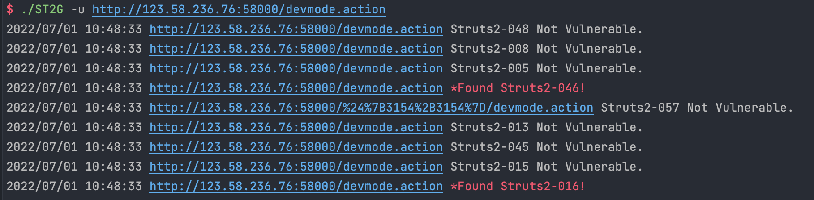
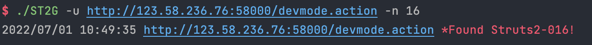
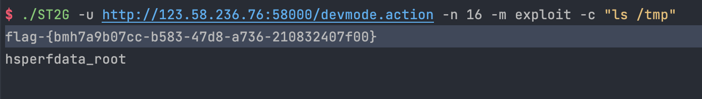

# STS2G 
项目源地址：[STS2G](https://github.com/xfiftyone/STS2G)
## 目的
golang代码编程练手
## 有何改变
+ 添加多线程处理
+ 添加批量扫描
+ 优化程序处理逻辑
+ 优化日志输出显示
+ 优化代码、调整格式
+ 简化命令行参数
## TODO
+ 文件批量扫描还是会抽风，需要优化
+ poc的添加，处理逻辑的优化
## 使用方法  
```
$ ./ST2G -h
NAME:
   ST2SG - Struts2 Scanner Written in Golang

USAGE:
   ST2SG -f target.txt
   ST2SG -u https://test.com/test.action
   ST2SG -u https://test.com/test.action --vn 15 -m check


COMMANDS:
   help, h  Shows a list of commands or help for one command

GLOBAL OPTIONS:
   -m value    Work mode, check or exploit (default: "check")
   -n value    Vulnerability number (default: 0)
   -u value    Set target url
   -c value    Exec command(Only works on mode exploit.)
   -d value    Specific vulnerability packets
   -f value    set target url file
   -t value    set thread (default: 20)
   --help, -h  show help (default: false)
```

## 功能截图
+ check

+ s016 

+ exploit
